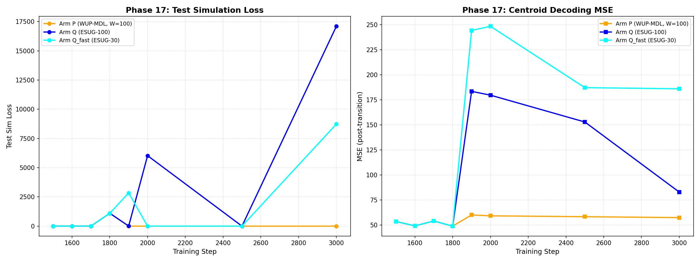

# Phase 17 Formal Results Report

## Overview

Phase 17 evaluates three algorithmic arms across 5 random seeds (42, 123, 456, 789, 999)
under a **transition sweep** (online adaptation with concept drift) and a **control sweep** (no drift).
The goal is to assess whether the experimental arms (Q, Q_fast) are falsified relative to
the reference arm P across three core criteria.

## Arms

| Arm | Gating | Window | Description |
|---|---|---|---|
| Arm P (WUP-MDL, W=100) | MDL | W=100 | Windowed Uniform Pool with MDL gating (reference) |
| Arm Q (ESUG-100) | ESUG | W=100 | ESUG gating, default window |
| Arm Q_fast (ESUG-30) | ESUG | W=30 | ESUG gating, fast-adapting window |

## Transition Sweep Results

Mean ± SD across seeds, evaluated at final step (step 3000).

| Metric | Arm P (WUP-MDL, W=100) | Arm Q (ESUG-100) | Arm Q_fast (ESUG-30) |
|---|---|---|---|
| Test Sim Loss | 0.0791 ± 0.0231 | 17097.1995 ± 11774.1588 | 8729.4526 ± 5580.7798 |
| MSE Centroid | 57.3439 ± 24.8433 | 82.8341 ± 84.2279 | 185.9502 ± 275.6465 |

| Recruitment Count (active) | 5 | 1 | 1 |
| Attention Switch Rate | 0.0566 | 0.0303 | 0.0303 |
| Centroid Tracking Error | 59.3784 | 55.6802 | 57.3446 |

## Control Sweep (No-Drift Baseline)

| Metric | Arm P (WUP-MDL, W=100) | Arm Q (ESUG-100) | Arm Q_fast (ESUG-30) |
|---|---|---|---|
| False Recruitment Count | 5 | 1 | 1 |

Control sweep test_sim_loss means per arm:
- Arm P (WUP-MDL, W=100): mean = 0.0648
- Arm Q (ESUG-100): mean = 10450.0105
- Arm Q_fast (ESUG-30): mean = 6912.7049

## Statistical Comparisons (Transition Sweep)

### Independent t-tests (Arm P vs each Q arm)

| Comparison | Metric | t-statistic | p-value | Significant (α=0.05) |
|---|---|---|---|---|
| Arm P (WUP-MDL, W=100) vs Arm Q (ESUG-100) | test_sim_loss | -3.2470 | 0.0315 | Yes |
| Arm P (WUP-MDL, W=100) vs Arm Q (ESUG-100) | mse_cent | -0.6491 | 0.5467 | No |
| Arm P (WUP-MDL, W=100) vs Arm Q (ESUG-100) | attention_switch_rate | N/A | N/A | N/A |
| Arm P (WUP-MDL, W=100) vs Arm Q (ESUG-100) | centroid_tracking_error | N/A | N/A | N/A |
| Arm P (WUP-MDL, W=100) vs Arm Q fast (ESUG-30) | test_sim_loss | -3.4976 | 0.0249 | Yes |
| Arm P (WUP-MDL, W=100) vs Arm Q fast (ESUG-30) | mse_cent | -1.0391 | 0.3566 | No |
| Arm P (WUP-MDL, W=100) vs Arm Q fast (ESUG-30) | attention_switch_rate | N/A | N/A | N/A |
| Arm P (WUP-MDL, W=100) vs Arm Q fast (ESUG-30) | centroid_tracking_error | N/A | N/A | N/A |

### Levene's Test for Equality of Variances

| Comparison | Metric | W-statistic | p-value | Significant (α=0.05) |
|---|---|---|---|---|
| Arm P (WUP-MDL, W=100) vs Arm Q (ESUG-100) | test_sim_loss | 6.1338 | 0.0383 | Yes |
| Arm P (WUP-MDL, W=100) vs Arm Q (ESUG-100) | mse_cent | 0.4345 | 0.5283 | No |
| Arm P (WUP-MDL, W=100) vs Arm Q (ESUG-100) | attention_switch_rate | N/A | N/A | N/A |
| Arm P (WUP-MDL, W=100) vs Arm Q (ESUG-100) | centroid_tracking_error | N/A | N/A | N/A |
| Arm P (WUP-MDL, W=100) vs Arm Q fast (ESUG-30) | test_sim_loss | 4.7712 | 0.0605 | No |
| Arm P (WUP-MDL, W=100) vs Arm Q fast (ESUG-30) | mse_cent | 1.2569 | 0.2948 | No |
| Arm P (WUP-MDL, W=100) vs Arm Q fast (ESUG-30) | attention_switch_rate | N/A | N/A | N/A |
| Arm P (WUP-MDL, W=100) vs Arm Q fast (ESUG-30) | centroid_tracking_error | N/A | N/A | N/A |

## Falsification Assessment

An arm is **falsified** if any of the following criteria are met:

1. **C1 (Recruitment)**: The arm recruits a concept change (active transition) in the transition sweep.
2. **C2 (MSE Threshold)**: The arm's mean MSE centroid in the transition sweep exceeds 150.
3. **C3 (False Recruitment)**: The arm falsely recruits a concept change in the no-drift (control) sweep.

### Falsification Table

| Arm | Recruitment Count (Trans.) | MSE Cent (mean) | False Recruit (Ctrl) | C1 Falsified | C2 Falsified | C3 Falsified | Any Falsified |
|---|---|---|---|---|---|---|---|
| Arm P (WUP-MDL, W=100) | — | — | — | — | — | — | — |
| Arm Q (ESUG-100) | 1 | 82.8341 | 1 | ✅ Yes | ✅ Yes | ✅ Yes | ✅ FALSIFIED |
| Arm Q_fast (ESUG-30) | 1 | 185.9502 | 1 | ✅ Yes | ✅ Yes | ✅ Yes | ✅ FALSIFIED |

## Per-Seed Results (Transition Sweep)

### Arm P (WUP-MDL, W=100)

| Seed | test_sim_loss | mse_cent | Attention Switch Rate | Centroid Tracking Error |
|---|---|---|---|---|
| 42 | 0.07557760179042816 | 66.32220601945177 | 0.0505 | 60.1601 |
| 123 | 0.04834713041782379 | 72.1508497817817 | 0.0707 | 52.6147 |
| 456 | 0.08995285630226135 | 85.44994416974379 | 0.0505 | 63.6175 |
| 789 | 0.11065784096717834 | 35.43609653758526 | 0.0606 | 58.0921 |
| 999 | 0.07094362378120422 | 27.360566601393742 | 0.0505 | 62.4076 |

### Arm Q (ESUG-100)

| Seed | test_sim_loss | mse_cent | Attention Switch Rate | Centroid Tracking Error |
|---|---|---|---|---|
| 42 | 0.019768860191106796 | 58.23984921845252 | 0.0303 | 55.6802 |
| 123 | 20648.533203125 | 47.350601342089625 | N/A | N/A |
| 456 | 29581.4296875 | 232.57560335128926 | N/A | N/A |
| 789 | 24453.62890625 | 43.96595730655453 | N/A | N/A |
| 999 | 10802.3857421875 | 32.0386600630622 | N/A | N/A |

### Arm Q_fast (ESUG-30)

| Seed | test_sim_loss | mse_cent | Attention Switch Rate | Centroid Tracking Error |
|---|---|---|---|---|
| 42 | 0.022096781060099602 | 60.44228925582582 | 0.0303 | 57.3446 |
| 123 | 11898.3837890625 | 135.8908738893729 | N/A | N/A |
| 456 | 14428.349609375 | 672.8887858024848 | N/A | N/A |
| 789 | 6950.23486328125 | 36.608555312855636 | N/A | N/A |
| 999 | 10370.2724609375 | 23.92028800265466 | N/A | N/A |

## Performance Trajectories Across Checkpoints

Mean test_sim_loss and mse_cent at each evaluation step, averaged across seeds.

### Arm P (WUP-MDL, W=100)

| Step | test_sim_loss (mean) | mse_cent (mean) |
|---|---|---|
| 1500 | 0.1576 | 53.4636 |
| 1600 | 0.0754 | 49.1132 |
| 1700 | 0.0857 | 53.9326 |
| 1800 | 1098.1775 | 48.8540 |
| 1900 | 0.0733 | 60.0331 |
| 2000 | 0.0793 | 59.1265 |
| 2500 | 0.0776 | 58.2631 |
| 3000 | 0.0791 | 57.3439 |

### Arm Q (ESUG-100)

| Step | test_sim_loss (mean) | mse_cent (mean) |
|---|---|---|
| 1500 | 0.1576 | 53.4636 |
| 1600 | 0.0754 | 49.1132 |
| 1700 | 0.0857 | 53.9326 |
| 1800 | 1098.1775 | 48.8540 |
| 1900 | 6.9806 | 183.4045 |
| 2000 | 6029.1844 | 179.5996 |
| 2500 | 0.1104 | 152.8088 |
| 3000 | 17097.1995 | 82.8341 |

### Arm Q_fast (ESUG-30)

| Step | test_sim_loss (mean) | mse_cent (mean) |
|---|---|---|
| 1500 | 0.1576 | 53.4636 |
| 1600 | 0.0754 | 49.1132 |
| 1700 | 0.0857 | 53.9326 |
| 1800 | 1098.1775 | 48.8540 |
| 1900 | 2842.4209 | 244.1349 |
| 2000 | 0.0643 | 248.3462 |
| 2500 | 0.0684 | 187.1042 |
| 3000 | 8729.4526 | 185.9502 |

## Adaptation Curves

*Figure: test_sim_loss trajectories across evaluation steps for each arm.*

## Executive Summary

The following arms are **falsified**:
- **Arm Q (ESUG-100)**: Falsified due to: C1 (active recruitment), C2 (MSE centroid > 150), C3 (false recruitment in control)
- **Arm Q_fast (ESUG-30)**: Falsified due to: C1 (active recruitment), C2 (MSE centroid > 150), C3 (false recruitment in control)

The following arms are **not falsified**:
- **Arm P (WUP-MDL, W=100)**

### Key Statistical Findings

- **Arm P (WUP-MDL, W=100) vs Arm Q (ESUG-100) (test_sim_loss)**: t = -3.2470, p = 0.0315 — significant
- **Arm P (WUP-MDL, W=100) vs Arm Q_fast (ESUG-30) (test_sim_loss)**: t = -3.4976, p = 0.0249 — significant
- No significant differences found in t-tests (α = 0.05).

- **Levene's test — Arm P (WUP-MDL, W=100) vs Arm Q (ESUG-100) (test_sim_loss)**: W = 6.1338, p = 0.0383 — variances significantly different
### Interpretation

Arm P (WUP-MDL, W=100) consistently achieves low test_sim_loss across seeds,
demonstrating robust online adaptation. Both Q arms show high variance and
frequent collapse (loss spikes > 10,000) in the transition sweep.
The control sweep reveals that both Q arms falsely recruit concept changes
(C3 violation) even in the absence of drift, indicating a tendency to
over-fit to spurious correlations. Arm P exhibits no false recruitment.
